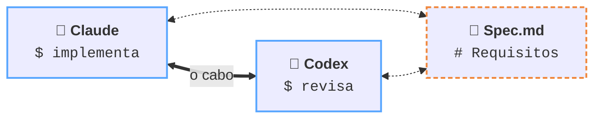

<h1 align="center">Atelier</h1>

<p align="center">
  <strong>Seu ateliê de agentes de IA</strong>
  <br>
  Um canvas infinito onde agentes de IA trabalham lado a lado — e conversam entre si sem você no meio.
</p>

<p align="center">
  <a href="#o-problema">O problema</a> ·
  <a href="#instalação">Instalação</a> ·
  <a href="#primeiros-passos">Primeiros passos</a> ·
  <a href="#como-funciona">Como funciona</a> ·
  <a href="#o-cli-atelier">CLI</a> ·
  <a href="#estado-do-projeto">Estado</a> ·
  <a href="#arquitetura">Arquitetura</a> ·
  <a href="#testes">Testes</a> ·
  <a href="#dados-em-disco">Dados</a> ·
  <a href="#solução-de-problemas">Problemas</a>
</p>

<p align="center">
  <code>macOS</code> · <code>Windows</code> · <code>Linux</code> ·
  <code>Electron</code> · <code>TypeScript</code> · <code>React</code> · <code>GPL-3.0</code>
</p>

---

## O problema

Rodar três agentes de IA ao mesmo tempo hoje significa três janelas de terminal e
você no meio, copiando contexto de uma para outra. Você vira o roteador humano:
lê a saída do agente A, resume, cola no agente B, espera, traz de volta. O
trabalho de coordenação cresce mais rápido que o trabalho em si.

O Atelier tira você desse caminho. Os agentes ficam num canvas espacial, você
liga um no outro com um cabo, e eles passam a se falar direto.



```console
Claude $ atelier ask "Codex" "revisa o diff em src/auth"
Codex  $ atelier note read "Spec"
```

Cada nó é um processo de verdade: terminais são PTYs, notas são arquivos `.md` em
disco. Nada é simulado.

---

## Instalação

**Requisitos:** Node 22+ e, no macOS, as Command Line Tools
(`xcode-select --install`).

```bash
git clone <url-do-repo> atelier
cd atelier
npm install
npm run dev
```

O `npm install` compila o `node-pty` para a sua plataforma e, no `postinstall`,
conserta dois problemas conhecidos de dependência nativa — os dois estão
documentados em [Solução de problemas](#solução-de-problemas).

`npm run dev` isola os dados em `~/.atelier-dev`, então rodar o projeto não
encosta em nenhum workspace real seu.

### Empacotar

```bash
npm run pack:mac      # .dmg + .zip
npm run pack:win      # instalador NSIS
npm run pack:linux    # AppImage + .deb
```

> Sem certificado de assinatura, o macOS pede botão direito → **Abrir** na
> primeira execução, e o SmartScreen do Windows avisa até o binário ganhar
> reputação.

### Nome e ícone

O ícone é `build/icon.svg`; `npm run icon` o renderiza (pelo próprio Electron,
sem ferramenta externa) para `build/icon.png`, de onde o electron-builder gera
`.icns` e `.ico` sozinho.

Em desenvolvimento o app roda dentro do `Electron.app` do `node_modules`, então
o Dock mostraria o nome e o ícone **dele**. O `postinstall` renomeia esse bundle
local para `Atelier.app` — a pasta, o executável, as chaves do `Info.plist` e o
ícone — e re-assina em seguida (editar o bundle invalida a assinatura). O nome
da **pasta** é o que mais importa: fora da App Store o Dock tira o rótulo do
nome do arquivo, então trocar só o `Info.plist` não muda nada.

É cosmético e vale só na sua máquina; o app empacotado tira nome e ícone do
`electron-builder.yml`. Se o Dock insistir no nome antigo, é cache dele:
`killall Dock` resolve (não fecha nada).

---

## Primeiros passos

Um passo a passo de dois minutos, do canvas vazio até dois agentes conversando.

1. **Crie dois terminais.** O ícone de terminal na dock — a pill na base do
   canvas — abre o diálogo **Novo Terminal**: escolha `Claude Code` no Início
   Rápido para um, `Codex` para o outro (ou digite o comando de qualquer CLI de
   agente que você use).
2. **Ligue um no outro.** Clique no `⇄` no cabeçalho do primeiro nó e depois no
   segundo. Um cabo aparece entre eles.
3. **Crie uma nota** com botão direito no vazio, escreva os requisitos, e ligue-a
   nos dois terminais.
4. **Dê uma responsabilidade a cada um** (opcional). Na aba **Agente** do
   diálogo, **+ Novo** cria uma — "Frontend", "Backend", o que fizer sentido — e
   o texto que você escrever é o que o agente lê quando roda `atelier role`.
5. **Peça ao primeiro agente para falar com o segundo:**

   ```
   Leia a nota "Spec" e peça ao Codex para revisar o que você implementou.
   ```

   Ele vai usar `atelier note read "Spec"` e `atelier ask "Codex" "..."` sozinho —
   o CLI já está no `PATH` dele e a skill de uso é injetada quando o cabo é criado.

A partir daqui, o cabo é o que define o alcance: um agente só enxerga aquilo em
que está ligado.

---

## Como funciona

### O canvas

| Ação | Como |
|---|---|
| Pan | Scroll |
| Pan com a mão | Segurar `espaço` e arrastar |
| Zoom | ⌘/Ctrl + scroll |
| Voltar a 100% | `⌘0` |
| Mover nó | Arrastar pelo cabeçalho |
| Redimensionar | Alça inferior direita |
| Seleção em área | Arrastar no vazio |
| Apagar | `Delete` |
| Ações do terminal | Selecionar — a barra sobe acima do nó |
| Criar nota | Botão direito no vazio |
| Criar terminal | Ícone de terminal na dock |

Só o que está na tela (mais 200px de margem) existe no DOM — o canvas aguenta
centenas de nós sem engasgar.

### Os nós

| Nó | O que é |
|---|---|
| **Terminal** | Um PTY de verdade, com xterm.js. Rode `claude`, `codex`, ou qualquer shell |
| **Nota** | Um arquivo `.md` em disco, editável no canvas e legível pelos agentes |
| **Texto** | Rótulo solto no canvas, para organizar visualmente |
| **Portal** | Um navegador embutido (`<webview>`), com barra de endereço e sessão isolada por nó |

Selecionar um nó desenha um anel tracejado azul em volta dele. No terminal, a
seleção também traz uma barra logo acima do card com quatro ações: **ligar**
(mesmo cabo do `⇄`), **editar** (abre o diálogo já preenchido), **recarregar**
(mata o processo e sobe outro no lugar) e **excluir**.

Editar aplica nome, ícone, cor, tema e responsabilidade na hora. Comando e
diretório de trabalho ficam gravados mas só valem no próximo boot do processo —
mudar o comando de um agente que está trabalhando não o interrompe; quem decide
isso é o botão de recarregar.

O rodapé do terminal repete a **linha de status do agente**: tokens da sessão,
contexto usado e as janelas de limite de uso — `tok 31.3k · ctx 3% · 5h 80% ·
7d 58%`. Janela em 85% ou mais fica vermelha.

Não existe API para nada disso: os números são raspados do que o próprio agente
imprime (`31,3k tok · 3% · 5h:80% 7d:58%` no Claude Code), lidos do fluxo do PTY
no processo principal — o que mantém a conta atualizada mesmo com o nó fora da
viewport, onde o renderer não recebe nada. Consequências honestas: o significado
é o que o agente dá ao número, campo que ele não imprime não vira zero (some do
rodapé), terminal sem linha de status nenhuma não ganha rodapé, e recarregar
zera tudo junto com o processo. O parser — inclusive a diferença entre `31,3k`
(decimal pt-BR) e `12,345` (milhar en-US) — está coberto por testes no smoke
(`scanAgentStatus`), que é onde um formato de terceiro quebra.

### As responsabilidades

Um terminal pode carregar uma **responsabilidade** — o que a interface chama de
agente. É um arquivo em `~/.atelier/roles/`, com nome, ícone, cor e o texto que
define o foco daquele agente.

Responsabilidades são **globais** (aparecem em todos os workspaces) ou presas a
um workspace só. O agente lê a própria responsabilidade com `atelier role`, e vê
a dos colegas conectados no `atelier list`.

O nome e a cor aparecem no cabeçalho do nó, então dá para ler o canvas inteiro
de longe e saber quem faz o quê.

### Os cabos

Clique no `⇄` no cabeçalho de um nó e depois no nó de destino. Entre os dois
cliques, um cabo tracejado azul sai da borda do primeiro nó e segue o cursor:
ele engrossa e o alvo ganha contorno quando o par aceita conexão, e fica
vermelho quando não aceita (dois textos, ou um par que já está ligado). Clicar
no vazio cancela, como o `Esc`.

O cabo tem física de verdade — integração de Verlet com 21 pontos, gravidade e
amortecimento — e adormece quando para de se mexer, para não queimar CPU à toa.
O fantasma usa a mesma simulação, então o cabo nasce na forma que ele já tinha.

O cabo não é decoração: **ele é a permissão**. Um agente só enxerga e conversa
com aquilo em que está ligado.

---

## O CLI `atelier`

Quando um terminal é conectado, o CLI `atelier` entra no `PATH` dele
automaticamente. É por ele que os agentes se falam.

```bash
atelier list                              # o que estou conectado?
atelier ask "Codex" "revisa o diff"       # manda e espera a resposta
atelier check "Codex" 40                  # últimas 40 linhas da saída dele
atelier note read "Spec"                  # lê uma nota conectada
atelier note write "Spec" "conteúdo"      # reescreve
atelier note create "rascunho"            # cria já conectada a mim
atelier role                              # qual é a minha responsabilidade?
atelier role list                         # as responsabilidades disponíveis
atelier debug                             # diagnóstico
```

`ask` bloqueia até o outro agente ficar ocioso. **Se estourar o tempo, use
`check` em vez de reenviar o prompt** — reenviar interrompe quem ainda está
trabalhando.

Comandos do app nativo que ainda não foram portados (`portal`, `recruit`,
`dismiss`, `connect`, `preset`) respondem com uma mensagem explícita de
"não implementado" em vez de falhar em silêncio.

### Como isso funciona por baixo

```
Terminal do agente
   │  atelier ask "Codex" "revisa o diff"
   ▼
Unix socket  (macOS/Linux)  ~/.atelier/run/agent.sock
named pipe   (Windows)      \\.\pipe\atelier
   ▼
Servidor IPC     POST /cli · header X-Terminal-ID
   ▼
Roteador → handler → escreve no PTY do destinatário
   ▼
resposta em texto puro, impressa no terminal de origem
```

Tudo fica em `127.0.0.1`. Nada sai da máquina.

O `X-Terminal-ID` é o que define o escopo: o servidor resolve quem é o chamador,
descobre em que ele está ligado, e recusa qualquer coisa fora disso.

O PTY também nasce com `ATELIER_ROLE` e `ATELIER_ROLE_ID` no ambiente quando o
terminal tem uma responsabilidade atribuída — útil para prompt e scripts; o
texto inteiro sai em `atelier role`.

---

## Estado do projeto

O núcleo está completo e utilizável no dia a dia; alguns tipos de nó ainda não
têm interface.

| Área | Estado |
|---|---|
| Canvas: pan, zoom, seleção, arrasto, resize, virtualização | ✅ |
| Cabos com física (Verlet, 21 pontos, auto-sleep) | ✅ |
| Nós Terminal (xterm.js + node-pty) | ✅ |
| Nós Nota (`.md` em disco) e Texto | ✅ |
| Persistência atômica, autosave, recuperação de crash | ✅ |
| Servidor IPC + CLI (`list`, `ask`, `check`, `note`, `role`, `debug`) | ✅ |
| Diálogo de terminal — novo e editar (presets, aparência, tema, fonte) | ✅ |
| Responsabilidades: criar, editar, atribuir, escopo global/workspace | ✅ |
| Múltiplos workspaces | ✅ |
| Nós Portal (navegador embutido) | ✅ |
| Desenho à mão livre (caneta, marca-texto, borracha) | ✅ |
| Nós File Tree, Shape, Stroke, Freehand | ⚠️ placeholder |
| Floors (git worktree), Routines, Git, SSH, Settings | ❌ |

**Nós em placeholder não são perdidos.** O codec lê e regrava todos os oito tipos
sem perda, então um workspace pode passar por aqui e voltar intacto.

### Como o Portal resolve o problema de composição

O obstáculo era arquitetural: as views nativas (`WebContentsView`) são compostas
*por cima* da página — ignoram `transform`, `z-index` e recorte. Num canvas com
pan e zoom, um navegador embutido ficaria sempre por cima, no tamanho errado.

A saída foi `<webview>` (habilitado por `webviewTag` em `window.ts`): é um
elemento do DOM de verdade, então herda o `transform` da camada de nós, é
recortado pelo `overflow` do nó e entra no mesmo empilhamento por `z-index` dos
outros nós. Pan, zoom e arrasto funcionam sem nenhum caso especial.

Sobre custo: cada portal é um processo de renderização. A mitigação é a mesma do
Terminal — abaixo de 40% de zoom o `<webview>` é desmontado e dá lugar a um
cartão estático (o host aparece no lugar), e portal fora da viewport nem monta,
porque a virtualização do canvas cuida disso.

O que já funciona: barra de endereço com busca (URL, `dominio.com`,
`localhost:3000` → `http://`, resto vira busca no Google), voltar/avançar,
recarregar/parar, página inicial, abrir no navegador do sistema, e sessão
isolada por nó via `partition` (`storageScope: 'shared'` compartilha cookies
entre portais). A URL é persistida a cada navegação concluída, então o nó reabre
onde parou. Popups (`target=_blank`) vão para o navegador do sistema, não abrem
janela solta dentro do app.

Ainda não portado: o comando `atelier portal` do CLI, que segue respondendo
"não implementado".

### Desenho no canvas

Caneta (`P`), marca-texto (`M`) e borracha (`E`) — `V` volta para a seleção,
`Esc` também. Com uma ferramenta de desenho ativa o arrasto vira traço em vez de
seleção ou pan, e a paleta e a espessura aparecem na barra.

Os traços ficam em `payload.drawings` — que o codec já lia e regravava desde o
início — e não são nós: não entram no z-index, não aceitam conexão, e são
desenhados na camada 2, entre a grade e os nós (desenhar por cima esconderia
terminal e portal).

Dois detalhes de implementação:

- **`<canvas>` não transformado**, como a grade: os pontos vivem em coordenadas
  de canvas e são projetados a cada frame. Escalar o canvas por CSS borraria o
  traço — o mesmo problema que o xterm tem.
- **O marca-texto é gravado com `lineWidth` negativo.** O `Drawing` do formato
  Maestri não tem campo de tipo, e o sinal sobrevive ao round-trip sem quebrar o
  app nativo, que lê o valor absoluto como espessura.

---

## Arquitetura

```
src/
├── main/                    processo principal (Node)
│   ├── core/
│   │   ├── models/          codec do formato em disco
│   │   ├── persistence/     escrita atômica, migrações, importação
│   │   ├── state/           AppState + WorkspaceManager (isDirty/autosave)
│   │   ├── terminal/        node-pty
│   │   ├── connection/      cabos + injeção de skill
│   │   └── interagent/      servidor IPC + roteador + handlers
│   ├── ipc/                 ponte para o renderer
│   ├── window.ts
│   └── index.ts             ordem de boot
├── preload/                 contextBridge tipado
├── renderer/                UI (React)
│   ├── canvas/              viewport, fundo, cabos, interação
│   ├── dialogs/             novo terminal + editor de responsabilidade
│   ├── nodes/               um componente por tipo de nó
│   └── state/               store com useSyncExternalStore
└── shared/                  tipos comuns
```

### Três invariantes

**1. A ordem de boot é fixa.** O servidor IPC sobe antes de qualquer terminal
existir. Se um PTY nascer antes, ele recebe porta zero e o CLI dentro dele nunca
encontra o app.

**2. Toda I/O de arquivo passa pelo `PersistenceManager`.** Ele faz escrita
atômica: grava um `.tmp`, dá `fsync`, e só então renomeia. Um crash no meio de um
save deixa o arquivo anterior íntegro em vez de um JSON pela metade.

**3. Pan, zoom e arrasto ficam fora do React.** Escrevem direto em
`style.transform`. Se entrarem no estado reativo, a árvore re-renderiza a cada
`mousemove` e os terminais entram em tempestade de refresh.

### O núcleo não importa `electron`

Nenhum módulo do `core/` importa `electron` no topo — os poucos usos são
`import()` dinâmico. Por isso o núcleo inteiro roda headless, e é isso que
permite testar boot, persistência e o protocolo do CLI sem abrir janela nenhuma.

---

## Testes

```bash
npm test              # 46 asserções, nenhuma precisa de display
npm run test:codec    # compatibilidade do formato em disco (18)
npm run test:smoke    # boot, canvas, persistência e CLI de ponta a ponta (28)
```

O smoke test não usa mock: ele sobe o servidor IPC de verdade e conversa com ele
por socket, com exatamente o mesmo HTTP que o CLI fala.

O CI roda os dois em macOS, Ubuntu e Windows — matriz de três runners porque o
`node-pty` é nativo e não aceita cross-compile. Duas armadilhas do Windows já
custaram build vermelho e estão resolvidas no `smoke-headless.mjs`:

- O bundle do núcleo é montado com um `stdin` de esbuild, e os imports ali são
  **relativos** (`./src/main/...`), resolvidos por `resolveDir`. Interpolar o
  caminho absoluto do projeto naquela string quebra no Windows: `C:\a\b` vira
  código TypeScript, onde `\a` e `\b` são escapes de string.
- O endereço do IPC no Windows é um named pipe, que **não existe no sistema de
  arquivos** — `existsSync` sempre diz que não está lá. A prova de que o servidor
  subiu é abrir uma conexão no pipe.

O teste de codec é o mais importante do projeto. Ele valida contra
`fixtures/full-workspace.json`, que cobre os oito tipos de nó e os seis tipos de
conexão, e exige que `encode(decode(x)) == x`.

### O formato em disco

O formato segue as convenções de codificação do Swift `Codable`, com quatro
regras que precisam ser respeitadas ao pé da letra — todas verificadas
empiricamente contra `swiftc`:

| Origem em Swift | Como fica no JSON |
|---|---|
| `UUID` | string **MAIÚSCULA** |
| `Date` com `.iso8601` | `"2026-08-23T17:12:00Z"` — **sem** milissegundos |
| `CGPoint` | `[x, y]` |
| `CGRect` | `[[x, y], [w, h]]` |
| `enum` com valor associado | `{ "<caso>": { "_0": … } }` |

Nada disso sai de graça de um `JSON.stringify` — daí o codec escrito à mão e o
teste que o guarda.

---

## Dados em disco

```
~/.atelier/
├── manifest.json                   índice de workspaces
├── preferences.json
├── app-state.json                  workspace ativo + flag de shutdown limpo
├── bin/atelier                     o CLI injetado nos terminais
├── roles/{UUID}.json               as responsabilidades (um arquivo cada)
├── run/agent.sock                  socket IPC (recriado a cada boot)
└── workspaces/{UUID}/
    ├── workspace.json              nós e cabos
    ├── notes/*.md                  as notas, como arquivos de verdade
    └── terminals/*.scrollback
```

As notas são arquivos comuns: dá para editá-las fora do app, versioná-las em git
ou apontar outro editor para elas.

### Desenvolvimento não toca nos seus dados

`npm run dev` aponta `ATELIER_HOME` para `~/.atelier-dev`. Para abrir os dados
reais durante o desenvolvimento, use `npm run dev:realdata` — e faça backup antes.

---

## Solução de problemas

O `postinstall` roda `scripts/fix-native-deps.mjs`, que conserta dois problemas
reproduzidos aqui. Ambos dão erros opacos, então ficam registrados:

| Sintoma | Causa | Correção |
|---|---|---|
| `posix_spawnp failed.` ao abrir qualquer terminal | o `spawn-helper` do node-pty chega em `prebuilds/` sem bit de execução (0644) | `chmod +x` no helper |
| `exited with signal SIGKILL`, sem mais nada | a Apple revogou a notarização de algumas versões do Electron; o Gatekeeper mata o processo (`spctl -a -vv` diz "revoked") | re-assinatura ad-hoc do bundle local do Electron |

Se algum voltar, rode `node scripts/fix-native-deps.mjs` — é idempotente.

**Rodando dentro do VS Code:** o terminal integrado exporta
`ELECTRON_RUN_AS_NODE=1`, o que faz o Electron subir em modo Node e falhar com
`Cannot read properties of undefined (reading 'requestSingleInstanceLock')`. Use
`env -u ELECTRON_RUN_AS_NODE npm run dev`, ou um terminal fora do editor.

**`atelier: command not found` dentro de um terminal do canvas:** o CLI só entra
no `PATH` de terminais **conectados**. Ligue um cabo e abra um terminal novo.

**`atelier ask` estourou o tempo:** o destinatário ainda está trabalhando. Use
`atelier check "<nome>"` para ver a saída dele — reenviar o `ask` interrompe o
trabalho em andamento.

---

## Comandos

| Comando | O que faz |
|---|---|
| `npm run dev` | Dev com hot reload, dados isolados em `~/.atelier-dev` |
| `npm run dev:realdata` | Dev apontando para `~/.atelier` |
| `npm run build` | Typecheck + build de produção |
| `npm run typecheck` | Só a checagem de tipos (main + renderer) |
| `npm test` | Codec + smoke |
| `npm run icon` | Regera `build/icon.png` a partir de `build/icon.svg` |
| `npm run pack:mac\|win\|linux` | Instaladores |

---

## Licença

GPL-3.0.
